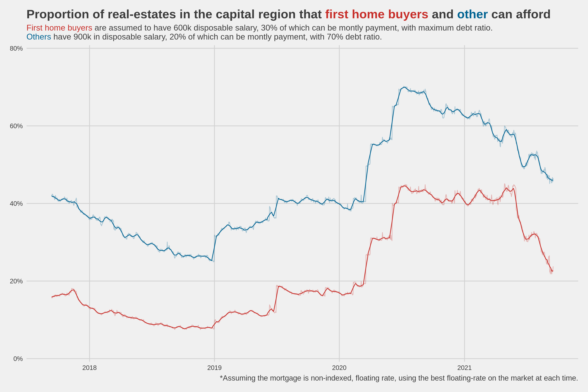
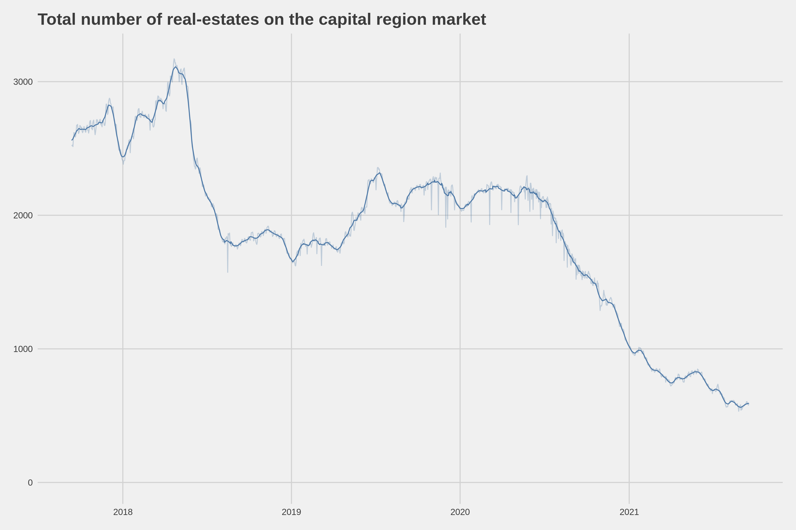
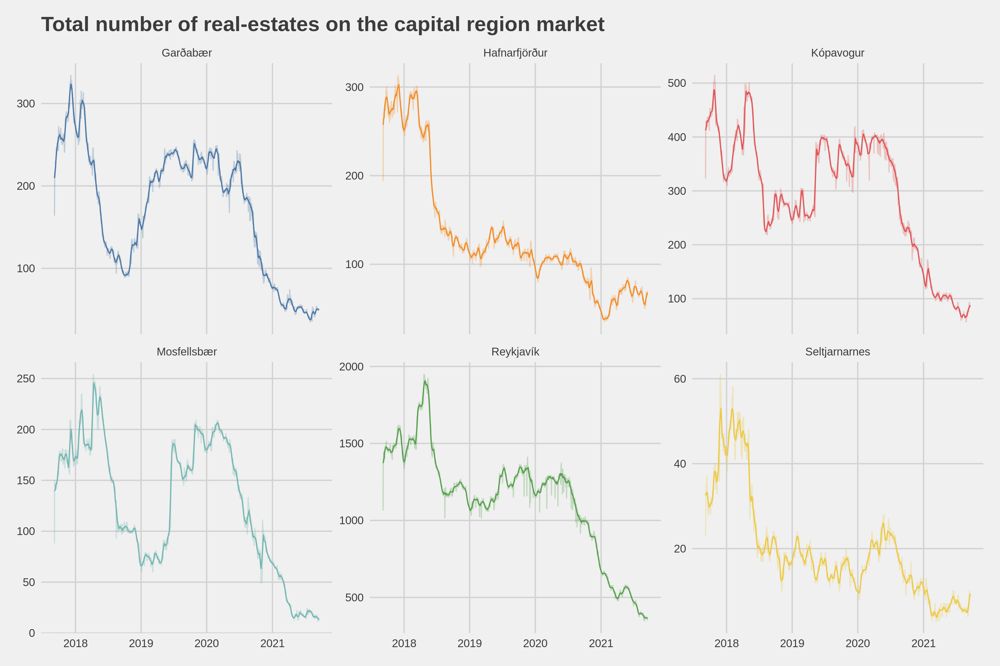
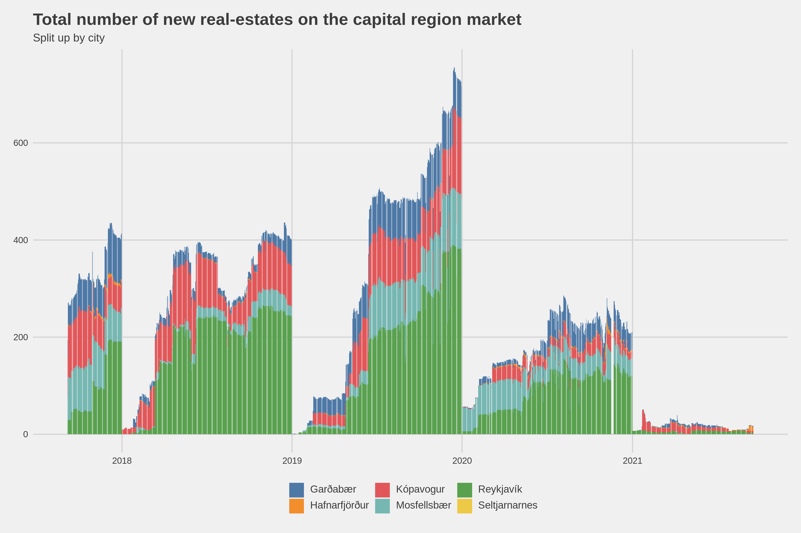
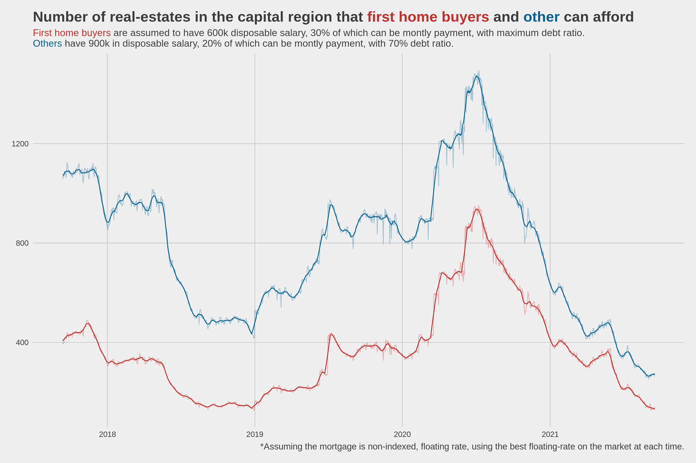

# Real estate market analysis

## Data

The data originates from a web-scaping project of mine, which has real-estate data since september 2017. The plots are generated using the `.csv` files and `Plots.ipynb` notebook.

## Plots

During the covid pendemic, my gut feeling was that this would cause the real-estate market to fall. What I failed to account for was the sudden cheap cash, introduced by the lower interest rate by the central bank. 

In the repository I put together a few graphs which show the total availability on the market, total number of new buildings and the effect of lower interest rates on two imaginary groups of people (first home buyers and others). 
The graph that I found most interesting is the one below, which shows the proportion of homes that these two groups can afford. In the beginning of 2020, first time buyers could only afford about 20% of the listed market in the capital region. But by mid 2020, this ratio went above 40%, more than doubling the options. Today (september 2021), the number has gone down again, mainly because of the market price increases and slightly higher interest rate. Today we are at 3.65% rate compared to about 5% in beginning of 2020. 

